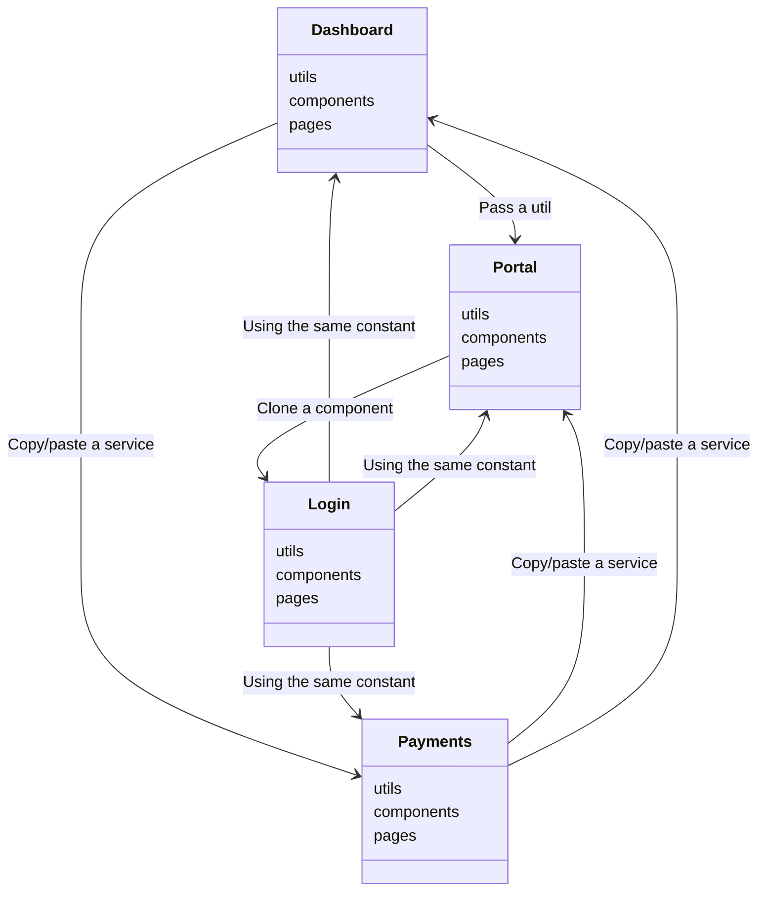
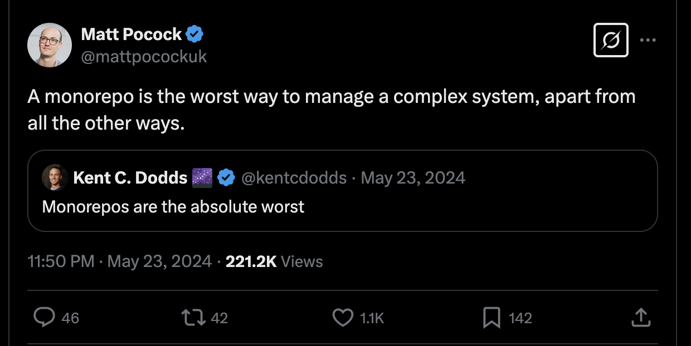

---
transition: fade-out
layout: two-cols
layoutClass: gap-16
---

# Micro frontends y Monorepos

By: Azael Fernandez 2025

<style>
h1 {
  background-color: #2B90B6;
  background-image: linear-gradient(45deg, #4EC5D4 10%, #146b8c 20%);
  background-size: 100%;
  -webkit-background-clip: text;
  -moz-background-clip: text;
  -webkit-text-fill-color: transparent;
  -moz-text-fill-color: transparent;
}
</style>

::right::

Contenido

<Toc text-sm minDepth="1" maxDepth="2" />

---
transition: slide-up
layout: center
layoutClass: text-center
---

# Misconceptions

<div v-click>
```
Monorepo !== Monolitico
```
</div>

<div v-click>
```
Complejidad !== Dificultad
```
</div>

---
transition: slide-up
layout: two-cols
layoutClass: gap-16
---

# Concepto de microfrontend

<br/>
<br/>

<div v-click>
Involucrados:
  <ul>
    <li>Host</li>
    <li>Component Remote (Microfrontend)</li>
  </ul>
</div>

<br/>
<div v-click>
Herramientas:
</div>
<ul>
    <li v-click v-mark.red>Zoid</li>
    <li v-click v-mark.red>Module federation</li>
</ul>

::right::
<br/>
<br/>
<br/>
<br/>
<div v-click>
  Ejemplo Proyecto X:
  <ul>
    <li>Portal</li>
    <li>Login</li>
    <li>Dashboard</li>
    <li>Help Center</li>
    <li>Account Settings</li>
    <li>Payments</li>
  </ul>
</div>

---
layout: image-right
image: https://cover.sli.dev
---

# Porque separar una app en apps mas pequenas?

<br/>
<br/>
<br/>
 <div v-click>
  <li>La compania tiene distintos departamentos y negocio no lo permite</li>
 </div>
 <br/>
 <div v-click>
  <li>Legacy Apps</li>
 </div>
 <br/>
 <div v-click>
  <li>Code complexity in a single repository</li>
 </div>
---
transition: slide-up
layout: two-cols
layoutClass: gap-16
---

# Monorepos (NPM Workspaces)

Cuando usar un monorepo?

```markdown{1|3-4|6|*}
- Correr localmente se vuelve complicado

- Duplicidad de codigo
- Inconsitencia en componentes similares

- E2E Testing se vuelve complicado
```


::right::

<div v-click class="grid grid-cols-4 gap-5 pt-4 -mb-6">



</div>

---

# Monorepo structure

````md magic-move {lines: true}
```md
# https://github.com/...../@x-project/payments
/x-project/payments
  /src
    /pages
    /components
    /utils
    /services
    /constants
# https://github.com/...../@x-project/portal
/x-project/portal
  /src
    /pages
    /components
    /utils
    /services
    /constants
# https://github.com/...../@x-project/dashboard
/x-project/dashboard
  /src
    /pages
    /components
    /utils
    /services
    /constants
# https://github.com/...../@x-project/login
/x-project/login
  /src
    /pages
    /components
    /utils
    /services
    /constants
```
```md
# https://github.com/...../@x-project/monorepo
/x-project/
  /apps
    /portal
    /payments
    /login
    /dashboard
  /src
    /components
    /utils
    /services
```
````

---
layout: center
image: text-center
---

# Warning!

### Code complexity




---
layout: center
class: text-center
---

# Thank you!

[Linkedin Profile](www.linkedin.com/in/azael-fernandez) · [Presentation GitHub](https://github.com/slidevjs/slidev) · [Tribu.dev](https://www.tribu.dev)

Azael Fernandez @ 2025

---
layout: center
class: text-center
---

# Questions

[Linkedin Profile](www.linkedin.com/in/azael-fernandez) · [Presentation GitHub](https://github.com/slidevjs/slidev) · [Tribu.dev](https://www.tribu.dev)

Azael Fernandez @ 2025

---

# References

1. Read more about [module federation](https://module-federation.io/index.html)

2. Read more about [zoid](http://krakenjs.com/zoid/)

3. Read more about [npm workspaces](https://docs.npmjs.com/cli/v7/using-npm/workspaces?v=true)